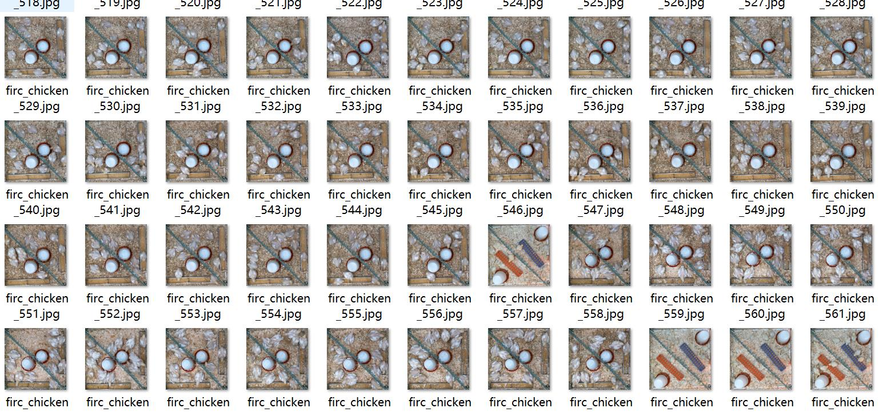
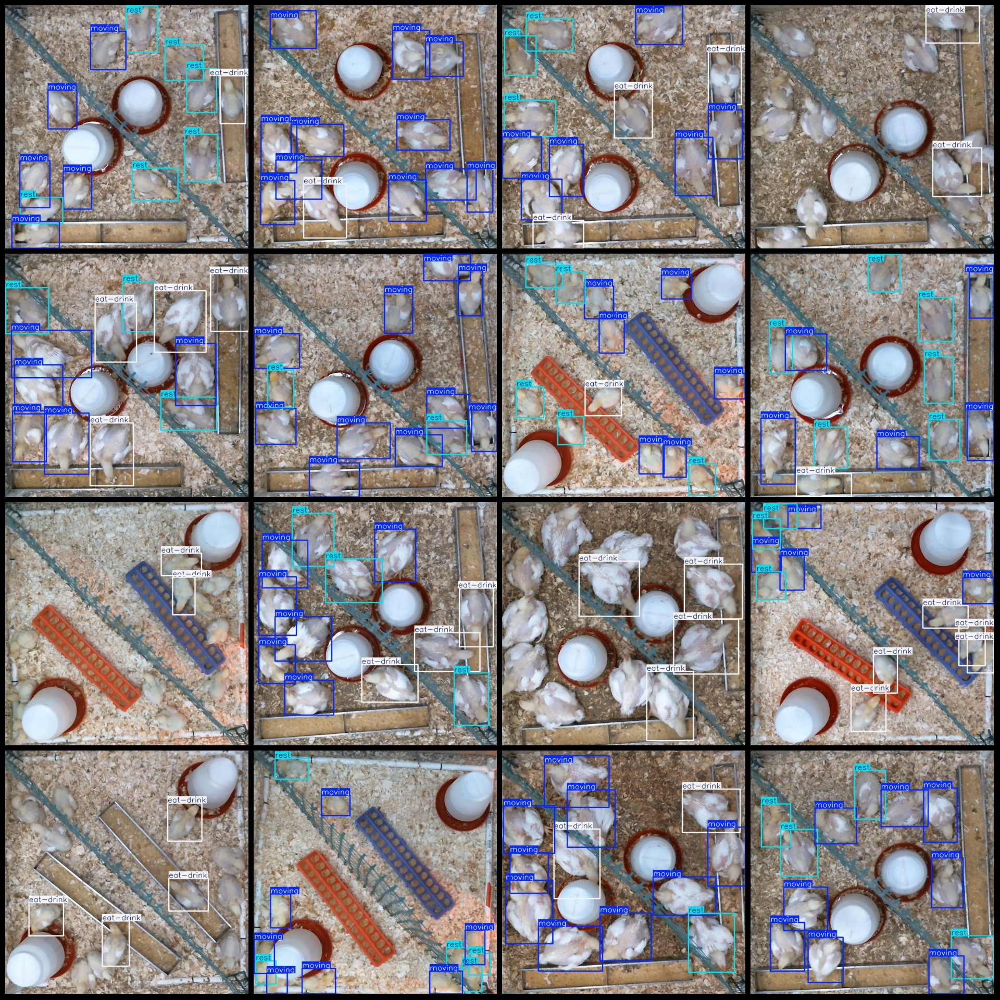

# 基于yolov11的小鸡鸡苗行为状态检测系统python源码+pytorch模型+评估指标曲线+精美GUI界面

【算法介绍】

在禽类养殖行业朝着智能化、精细化方向稳步迈进的关键阶段，精准且高效地监测鸡舍小鸡鸡苗的行为状态，已然成为保障养殖效益、提升动物福利以及防控疾病的核心挑战之一。鸡舍环境复杂多变，小鸡鸡苗的行为状态丰富多样，像日常的吃喝活动、四处走动探索、安静休息睡眠等，这些行为不仅直观反映了小鸡鸡苗当下的生理健康状况，更与养殖场的整体生产效率、疾病传播风险等紧密相连。一旦小鸡鸡苗出现异常行为，如长时间不进食、频繁扎堆、行动无力等，若未能及时察觉并采取相应措施，极易引发疾病大规模传播、生长速度减缓甚至鸡苗意外死亡，给养殖场带来巨大的经济损失。

传统鸡舍小鸡鸡苗行为状态检测方式主要依赖人工巡查。然而，受养殖场规模不断扩大、鸡苗数量日益增多以及鸡舍空间布局复杂等因素限制，人工巡查很难全面覆盖鸡舍的各个区域，尤其是那些隐藏在鸡群深处或处于角落位置的小鸡鸡苗状态，往往难以被及时观察到。而且，早期基于简单规则设定的监测方法，由于小鸡鸡苗羽毛颜色各异、鸡舍内光照条件不稳定以及各种设备、杂物遮挡等因素干扰，误判率高达 35%以上，根本无法满足养殖场“精准化、零疏漏”的管理需求。因此，开发一套具备高精度、强适应性且能实时监测的鸡舍小鸡鸡苗行为状态智能检测系统，成为提升养殖场管理水平和养殖效益的关键技术突破点。

目前现有技术存在诸多明显瓶颈：人工巡查不仅效率极其低下（单人单日仅能完成有限数量小鸡鸡苗的观察），而且巡查人员还面临着被鸡苗啄伤、长时间工作导致观察疲劳等风险；基于颜色和简单形状分割的传统算法，难以准确区分小鸡鸡苗的正常行为与异常行为（例如，小鸡鸡苗正常休息时的蜷缩姿态与因疾病导致的不适蜷缩），在光线昏暗、鸡舍内粉尘弥漫等低能见度环境下，算法性能会急剧下降；传统目标检测模型对小鸡鸡苗行为的多样性（如快速奔跑、缓慢踱步、相互啄咬等不同行为模式）和尺度变化（从刚孵化的小鸡的弱小到稍大鸡苗的相对健壮）适应性较差，对于小目标（如刚出壳的小鸡）的行为漏检率超过 45%，难以满足实际养殖场景的复杂需求。

基于 YOLOv11 的鸡舍小鸡鸡苗行为状态检测系统为禽类养殖管理带来了革命性的变革。YOLOv11 作为先进的目标检测算法，具备强大的特征提取和实时检测能力。该系统充分发挥 YOLOv11 的端到端实时检测优势，并针对鸡舍复杂环境进行了深度优化。

此系统能够精准识别小鸡鸡苗丰富多样的行为类别，具体涵盖：

eat - drink（吃喝）：准确捕捉小鸡鸡苗进食和饮水时的姿态和动作，判断其进食和饮水是否正常，及时发现因饲料变质、饮水设备故障或健康问题导致的进食和饮水异常情况。
moving（走动）：实时监测小鸡鸡苗的走动行为，分析走动频率、范围等数据，为评估小鸡鸡苗的活力和探索能力提供依据。
rest（休息）：敏锐识别小鸡鸡苗的休息行为，区分正常休息和因疾病、不适导致的异常休息，避免病情恶化引发更严重的后果。
通过对大量小鸡鸡苗行为状态图像数据的学习和训练，系统无能保持较高的检测准确率。同时，系统具备强大的抗干扰能力，能够有效应对鸡舍内设备、羽毛等干扰因素，为新型智能化养殖场建设提供了坚实的技术支撑，助力养殖场实现高效、精准、科学的养殖管理。

【效果展示】

<div style="text-align:center;"></div>

<div style="text-align:center;">&nbsp;</div>


【测试环境】

windows10
anaconda3+python3.8
torch==2.3.1
ultralytics==8.3.81

【模型可以检测出类别】

eat-drink
moving
rest

【训练数据集介绍】

数据集格式：Pascal VOC格式+YOLO格式(不包含分割路径的txt文件，仅仅包含jpg图片以及对应的VOC格式xml文件和yolo格式txt文件)

图片数量(jpg文件个数)：1698

标注数量(xml文件个数)：1698

标注数量(txt文件个数)：1698

标注类别数：3

所在仓库：firc-dataset

标注类别名称(注意yolo格式类别顺序不和这个对应，而以labels文件夹classes.txt为准):["eat-drink","moving","rest"]

每个类别标注的框数：

eat-drink 框数 = 4427

moving 框数 = 7905

rest 框数 = 6286

总框数：18618

使用标注工具：labelImg

标注规则：对类别进行画矩形框

重要说明：暂无

特别声明：本数据集不对训练的模型或者权重文件精度作任何保证，数据集只提供准确且合理标注

图片预览：



标注例子：



【训练信息】

| 参数 | 值 |
|:---:|:---:|
| 训练集图片数 | 1613 |
| 验证集图片数 | 85 |
| 训练map | 80.4% |
| 训练精度(Precision) | 73.2% |
| 训练召回率(Recall) | 79.9% |

【验证集精度统计】

| Class | Images | Instances | P | R | mAP50 | mAP50-95 |
|:---:|:---:|:---:|:---:|:---:|:---:|:---:|
| all | 85 | 918 | 0.732 | 0.799 | 0.804 | 0.66 |
| eat-drink | 73 | 189 | 0.851 | 0.905 | 0.937 | 0.752 |
| moving | 73 | 399 | 0.668 | 0.774 | 0.754 | 0.63 |
| rest | 75 | 330 | 0.678 | 0.718 | 0.72 | 0.597 |

【界面设计】

```
class Ui_MainWindow(QtWidgets.QMainWindow):
    signal = QtCore.pyqtSignal(str, str)
 
    def setupUi(self):
        self.setObjectName("MainWindow")
        self.resize(1280, 728)
        self.centralwidget = QtWidgets.QWidget(self)
        self.centralwidget.setObjectName("centralwidget")
 
        self.weights_dir = './weights'
 
        self.picture = QtWidgets.QLabel(self.centralwidget)
        self.picture.setGeometry(QtCore.QRect(260, 10, 1010, 630))
        self.picture.setStyleSheet("background:black")
        self.picture.setObjectName("picture")
        self.picture.setScaledContents(True)
        self.label_2 = QtWidgets.QLabel(self.centralwidget)
        self.label_2.setGeometry(QtCore.QRect(10, 10, 81, 21))
        self.label_2.setObjectName("label_2")
        self.cb_weights = QtWidgets.QComboBox(self.centralwidget)
        self.cb_weights.setGeometry(QtCore.QRect(10, 40, 241, 21))
        self.cb_weights.setObjectName("cb_weights")
        self.cb_weights.currentIndexChanged.connect(self.cb_weights_changed)
 
        self.label_3 = QtWidgets.QLabel(self.centralwidget)
        self.label_3.setGeometry(QtCore.QRect(10, 70, 72, 21))
        self.label_3.setObjectName("label_3")
        self.hs_conf = QtWidgets.QSlider(self.centralwidget)
        self.hs_conf.setGeometry(QtCore.QRect(10, 100, 181, 22))
        self.hs_conf.setProperty("value", 25)
        self.hs_conf.setOrientation(QtCore.Qt.Horizontal)
        self.hs_conf.setObjectName("hs_conf")
        self.hs_conf.valueChanged.connect(self.conf_change)
        self.dsb_conf = QtWidgets.QDoubleSpinBox(self.centralwidget)
        self.dsb_conf.setGeometry(QtCore.QRect(200, 100, 51, 22))
        self.dsb_conf.setMaximum(1.0)
        self.dsb_conf.setSingleStep(0.01)
        self.dsb_conf.setProperty("value", 0.25)
        self.dsb_conf.setObjectName("dsb_conf")
        self.dsb_conf.valueChanged.connect(self.dsb_conf_change)
        self.dsb_iou = QtWidgets.QDoubleSpinBox(self.centralwidget)
        self.dsb_iou.setGeometry(QtCore.QRect(200, 160, 51, 22))
        self.dsb_iou.setMaximum(1.0)
        self.dsb_iou.setSingleStep(0.01)
        self.dsb_iou.setProperty("value", 0.45)
        self.dsb_iou.setObjectName("dsb_iou")
        self.dsb_iou.valueChanged.connect(self.dsb_iou_change)
        self.hs_iou = QtWidgets.QSlider(self.centralwidget)
        self.hs_iou.setGeometry(QtCore.QRect(10, 160, 181, 22))
        self.hs_iou.setProperty("value", 45)
        self.hs_iou.setOrientation(QtCore.Qt.Horizontal)
        self.hs_iou.setObjectName("hs_iou")
        self.hs_iou.valueChanged.connect(self.iou_change)
        self.label_4 = QtWidgets.QLabel(self.centralwidget)
        self.label_4.setGeometry(QtCore.QRect(10, 130, 72, 21))
        self.label_4.setObjectName("label_4")
        self.label_5 = QtWidgets.QLabel(self.centralwidget)
        self.label_5.setGeometry(QtCore.QRect(10, 210, 72, 21))
        self.label_5.setObjectName("label_5")
        self.le_res = QtWidgets.QTextEdit(self.centralwidget)
        self.le_res.setGeometry(QtCore.QRect(10, 240, 241, 400))
        self.le_res.setObjectName("le_res")
        self.setCentralWidget(self.centralwidget)
        self.menubar = QtWidgets.QMenuBar(self)
        self.menubar.setGeometry(QtCore.QRect(0, 0, 1110, 30))
        self.menubar.setObjectName("menubar")
        self.setMenuBar(self.menubar)
        self.statusbar = QtWidgets.QStatusBar(self)
        self.statusbar.setObjectName("statusbar")
        self.setStatusBar(self.statusbar)
        self.toolBar = QtWidgets.QToolBar(self)
        self.toolBar.setToolButtonStyle(QtCore.Qt.ToolButtonTextBesideIcon)
        self.toolBar.setObjectName("toolBar")
        self.addToolBar(QtCore.Qt.TopToolBarArea, self.toolBar)
        self.actionopenpic = QtWidgets.QAction(self)
        icon = QtGui.QIcon()
        icon.addPixmap(QtGui.QPixmap(":/images/1.png"), QtGui.QIcon.Normal, QtGui.QIcon.Off)
        self.actionopenpic.setIcon(icon)
        self.actionopenpic.setObjectName("actionopenpic")
        self.actionopenpic.triggered.connect(self.open_image)
        self.action = QtWidgets.QAction(self)
        icon1 = QtGui.QIcon()
        icon1.addPixmap(QtGui.QPixmap(":/images/2.png"), QtGui.QIcon.Normal, QtGui.QIcon.Off)
        self.action.setIcon(icon1)
        self.action.setObjectName("action")
        self.action.triggered.connect(self.open_video)
        self.action_2 = QtWidgets.QAction(self)
        icon2 = QtGui.QIcon()
        icon2.addPixmap(QtGui.QPixmap(":/images/3.png"), QtGui.QIcon.Normal, QtGui.QIcon.Off)
        self.action_2.setIcon(icon2)
        self.action_2.setObjectName("action_2")
        self.action_2.triggered.connect(self.open_camera)
 
        self.actionexit = QtWidgets.QAction(self)
        icon3 = QtGui.QIcon()
        icon3.addPixmap(QtGui.QPixmap(":/images/4.png"), QtGui.QIcon.Normal, QtGui.QIcon.Off)
        self.actionexit.setIcon(icon3)
        self.actionexit.setObjectName("actionexit")
        self.actionexit.triggered.connect(self.exit)
 
        self.toolBar.addAction(self.actionopenpic)
        self.toolBar.addAction(self.action)
        self.toolBar.addAction(self.action_2)
        self.toolBar.addAction(self.actionexit)
 
        self.retranslateUi()
        QtCore.QMetaObject.connectSlotsByName(self)
        self.init_all()
```


【常用评估参数介绍】

在目标检测任务中，评估模型的性能是至关重要的。你提到的几个术语是评估模型性能的常用指标。下面是对这些术语的详细解释：

Class：
这通常指的是模型被设计用来检测的目标类别。例如，一个模型可能被训练来检测车辆、行人或动物等不同类别的对象。
Images：
表示验证集中的图片数量。验证集是用来评估模型性能的数据集，与训练集分开，以确保评估结果的公正性。
Instances：
在所有图片中目标对象的总数。这包括了所有类别对象的总和，例如，如果验证集包含100张图片，每张图片平均有5个目标对象，则Instances为500。
P（精确度Precision）：
精确度是模型预测为正样本的实例中，真正为正样本的比例。计算公式为：Precision = TP / (TP + FP)，其中TP表示真正例（True Positives），FP表示假正例（False Positives）。
R（召回率Recall）：
召回率是所有真正的正样本中被模型正确预测为正样本的比例。计算公式为：Recall = TP / (TP + FN)，其中FN表示假负例（False Negatives）。
mAP50：
表示在IoU（交并比）阈值为0.5时的平均精度（mean Average Precision）。IoU是衡量预测框和真实框重叠程度的指标。mAP是一个综合指标，考虑了精确度和召回率，用于评估模型在不同召回率水平上的性能。在IoU=0.5时，如果预测框与真实框的重叠程度达到或超过50%，则认为该预测是正确的。
mAP50-95：
表示在IoU从0.5到0.95（间隔0.05）的范围内，模型的平均精度。这是一个更严格的评估标准，要求预测框与真实框的重叠程度更高。在目标检测任务中，更高的IoU阈值意味着模型需要更准确地定位目标对象。mAP50-95的计算考虑了从宽松到严格的多个IoU阈值，因此能够更全面地评估模型的性能。
这些指标共同构成了评估目标检测模型性能的重要框架。通过比较不同模型在这些指标上的表现，可以判断哪个模型在实际应用中可能更有效。

【使用步骤】

使用步骤：
（1）首先根据官方框架ultralytics安装教程安装好yolov11环境，并安装好pyqt5
（2）切换到自己安装的yolo11环境后，并切换到源码目录，执行python main.py即可运行启动界面，进行相应的操作即可

【提供文件】

python源码
yolo11n.pt模型
训练的map,P,R曲线图(在weights\results.png)
测试图片（在test_img文件夹下面）

注意提供训练的数据集，请到mytxt.txt文件中找到地址
